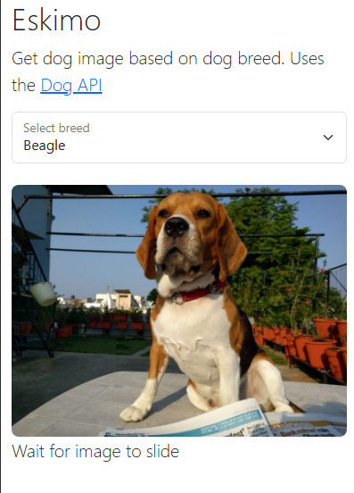

# ESKEMO

Image carousel based on dog breed 

## About

This is a simple project to get started with Vite and Bootstrap. 


## Features
- Fetches dog breeds from [Dog API](https://dog.ceo/dog-api/)
- Fetches dog images based on breed
- Renders carousel with images
- Renders select with dog breeds

## Preview


## Setup

1. Clone the repo
2. Install dependencies
   ```sh
   npm install
   ```
3. Start the dev server
   ```sh
   npm run dev
   ```

## License

MIT © [Abdullah Al-Faqeir](https://github.com/AbdullahAlFaqeir)